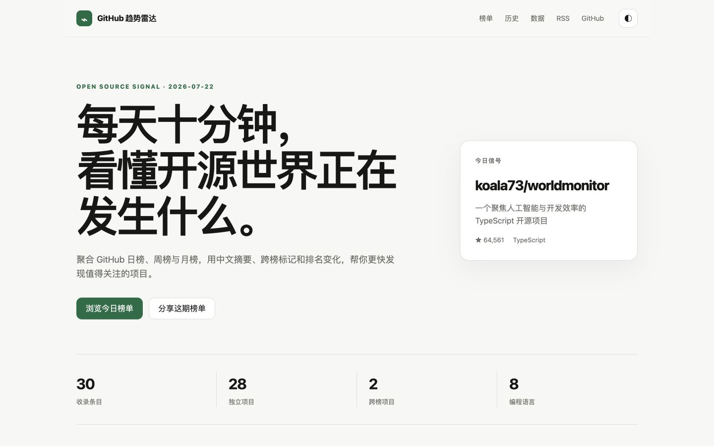
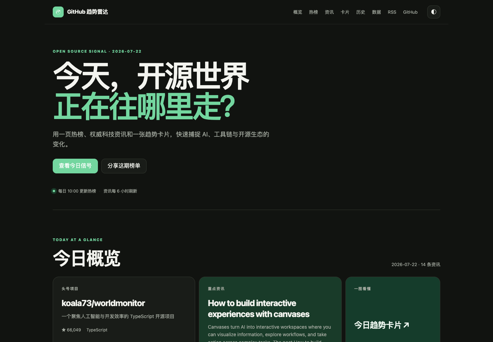
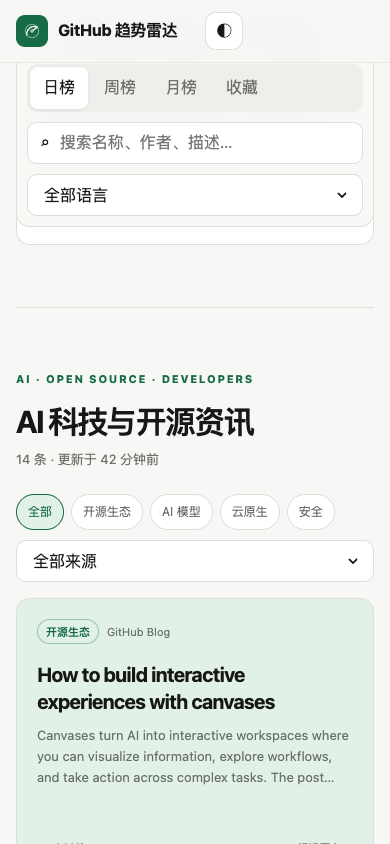
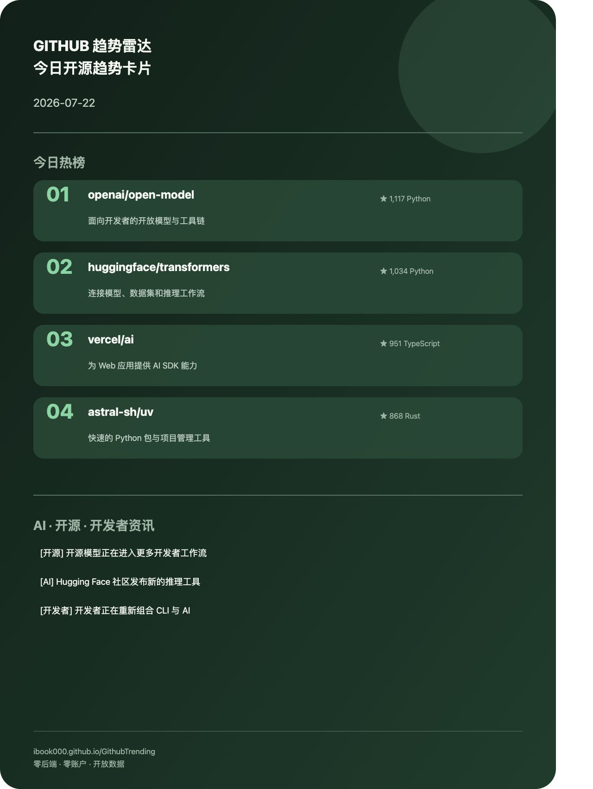
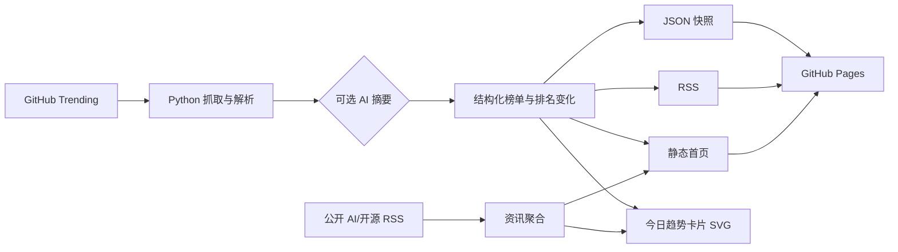

# GitHub 趋势雷达

[](https://github.com/Ibook000/GithubTrending/actions/workflows/generate_trending.yml)
[](https://www.python.org/)
[](LICENSE)
[](https://ibook000.github.io/GithubTrending/)

每天更新的 GitHub Trending 中文技术榜单，并自动聚合 AI、开源和开发者生态资讯。用搜索、语言筛选、中文速览、跨榜标记、排名变化和趋势卡片，帮你在十分钟内看懂开源世界正在发生什么。

**[在线体验](https://ibook000.github.io/GithubTrending/) · [最新 JSON](https://ibook000.github.io/GithubTrending/data/latest.json) · [RSS 订阅](https://ibook000.github.io/GithubTrending/feed.xml) · [历史档案](https://ibook000.github.io/GithubTrending/history/)**

## 界面预览

| 浅色模式 | 深色模式 |
| --- | --- |
|  |  |

<p align="center">
  
  
</p>

页面不依赖前端框架，桌面与移动端共享同一份轻量 HTML、CSS 和原生 JavaScript。

## 为什么做这个项目

GitHub Trending 很适合发现项目，但原始页面缺少中文信息、跨周期对比、历史变化和可复用数据。GitHub 趋势雷达在保持零后端、零账户、零追踪的前提下，补齐这些能力：

- 日榜、周榜、月榜每日自动更新
- 中文 AI 摘要；没有 API Key 时自动使用本地摘要
- AI、开源与开发者生态公开 RSS 资讯聚合
- 自动生成“今日开源趋势卡片”，支持 SVG 下载和分享
- 搜索、语言筛选、排名变化、跨榜项目识别
- 浏览器本地收藏和原生分享，不上传个人数据
- 稳定 JSON、每日快照与 RSS 2.0
- 深浅主题、移动端、键盘导航和 reduced-motion
- 历史档案长期保存在 `gh-pages` 分支

## 快速开始

```bash
git clone https://github.com/Ibook000/GithubTrending.git
cd GithubTrending
python -m venv .venv
source .venv/bin/activate
pip install -r requirements.txt
python github_trending_cards.py
python -m http.server 8000 -d site
```

打开 <http://localhost:8000>。不配置任何密钥也能完整运行。

### 可选 AI 摘要

```bash
export LLM_API_KEY="your-api-key" # 自托管接口不需要鉴权时可省略
export LLM_BASE_URL="http://154.217.247.37:8317/v1"
export LLM_MODEL="deepseek-v4-flash"
python github_trending_cards.py
```

也可以继续使用 `NVIDIA_API_KEY` 或 `OPENROUTER_API_KEY`。密钥只在生成过程中使用，不会写入 HTML、JSON、RSS 或日志。

> 默认接口是明文 HTTP。请不要通过它发送敏感数据；生产环境建议改成 HTTPS，并通过 `LLM_BASE_URL`、`LLM_MODEL` 和 `LLM_API_KEY` 覆盖默认配置。

## 开放数据

| 地址 | 内容 |
| --- | --- |
| `data/latest.json` | 最新完整日/周/月榜单 |
| `data/YYYY-MM-DD.json` | 每日不可变快照 |
| `feed.xml` | 每日日榜 RSS 2.0 |
| `today-card.svg` | 今日趋势卡片（开放 SVG） |

JSON 顶层结构：

```json
{
  "schema_version": "1.0",
  "generated_at": "2026-07-22T10:00:00+08:00",
  "news": [],
  "periods": {
    "daily": [],
    "weekly": [],
    "monthly": []
  }
}
```

每个仓库包含 `rank`、`previous_rank`、`movement`、`periods`、语言、Star、Fork、原始描述和中文摘要。首次记录或缺少可比较历史时明确标记为“新上榜”。`news` 为公开 RSS 资讯，包含标题、链接、来源、分类、发布时间和短摘要；新闻源暂时不可用不会阻断榜单发布。

## 工作原理



核心源码位于 `src/github_trending/`，静态资源位于 `assets/`，维护脚本位于 `scripts/`，自动化测试位于 `tests/`。生成目录 `site/` 和历史数据不会提交到 `main`。

## Fork 后自动部署

1. Fork 仓库，在 Settings → Pages 中允许 GitHub Actions/`gh-pages` 发布。
2. 在 Actions 中手动运行“自动生成 GitHub 趋势雷达”，或等待北京时间每天 10:00 自动执行。
3. 如需 AI 摘要，在 Secrets and variables → Actions 添加 `NVIDIA_API_KEY`。
4. 可通过仓库变量 `SITE_URL` 覆盖 Pages 地址。

工作流会先测试和校验生成物；日榜抓取为空时会停止部署，避免空页面覆盖上一版。

## 开发与贡献

```bash
pip install -r requirements-dev.txt
pytest
ruff check .
```

欢迎提交抓取兼容性、无障碍、中文摘要或开放数据相关改进。开始前请阅读 [贡献指南](CONTRIBUTING.md)、[行为准则](CODE_OF_CONDUCT.md) 和 [安全政策](SECURITY.md)。

## 路线图

- [x] 搜索、语言筛选、收藏与分享
- [x] 排名变化、跨榜标记和历史档案
- [x] 开放 JSON 与 RSS
- [x] AI / 开源资讯聚合与今日趋势卡片
- [ ] 基于结构化历史的语言和主题趋势报告
- [ ] 可选的每周技术趋势总结
- [ ] 社区维护的高质量项目标签

## License

[Apache License 2.0](LICENSE) © 2026 Ibook000
