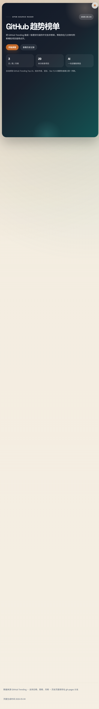

# GithubTrending

一个自动抓取并展示 GitHub Trending 热门仓库的开源项目，支持日榜、周榜、月榜，并可通过 AI 自动生成项目中文一句话总结。

## 项目亮点
- 🚀 自动抓取 GitHub Trending 前 10 热门仓库，覆盖日榜、周榜、月榜
- 🤖 支持生成中文 AI 一句话总结，方便快速判断项目价值
- 🎨 首页已升级为更强视觉层级的海报式榜单页面，支持深浅主题切换
- 🏷️ 支持按时间窗口切换热度，首页包含今日焦点项目与榜单摘要
- 📅 历史页面升级为档案馆式浏览体验，可回看每天的榜单快照
- 🌐 通过 GitHub Actions 和 GitHub Pages 自动发布，开箱即用

## 当前界面

### 首页
- 海报式 Hero 首屏
- 日榜 / 周榜 / 月榜切换
- 今日焦点项目展示
- 榜单条目分层排版
- 深色 / 浅色主题切换

### 历史页
- 历史档案首页
- 总归档天数、最新日期、完整率、连续归档天数统计
- 按日期倒序浏览历史快照
- 一键打开任意日期的榜单页面

## 快速开始
1. 安装依赖
```bash
pip install -r requirements.txt
```

2. 本地生成最新榜单
```bash
python github_trending_cards.py
```

3. 本地生成历史档案页
```bash
python generate_history_stats.py
```

4. 用浏览器打开 `github_trending_cards.html` 查看页面

## AI 总结配置

### 本地运行
在 PowerShell 中设置环境变量：

```powershell
$env:NVIDIA_API_KEY="your-api-key"
python github_trending_cards.py
```

### GitHub Actions 自动运行
如果你使用 GitHub Actions 自动生成页面，请在仓库中配置：

1. 打开仓库 `Settings`
2. 进入 `Secrets and variables` -> `Actions`
3. 新建 Repository secret
4. 名称填写 `NVIDIA_API_KEY`
5. 值填写你的 API Key

项目会从环境变量读取密钥，不需要把 API Key 写进代码文件。

## GitHub Pages 与历史记录
本项目通过 GitHub Actions 每天北京时间 10 点自动运行，并将结果发布到 `gh-pages` 分支。

- 最新页面发布在仓库 Pages 首页
- 历史档案页位于 `history/index.html`
- 每日快照保存到 `history/YYYY-MM-DD/`
- 每个历史目录包含页面、样式和元数据文件

### 访问方式
1. 打开 GitHub Pages 页面
   [https://ibook000.github.io/GithubTrending](https://ibook000.github.io/GithubTrending)
2. 点击首页中的“查看历史记录”
3. 在历史档案页中选择任意日期查看快照

## 项目结构
```text
├── github_trending_cards.py    # 主程序：抓取 Trending、生成 AI 总结、输出首页
├── github_trending_cards.css   # 首页样式文件
├── github_trending_cards.html  # 生成后的首页 HTML
├── generate_history_stats.py   # 历史档案页生成器
├── history/                    # 历史快照目录
├── .github/workflows/          # GitHub Actions 工作流
└── img.png                     # 项目预览图
```

## 效果预览

### 首页预览


### 历史页预览


### 项目图标


## 技术栈
- Python 3.11+
- requests
- beautifulsoup4
- openai
- HTML + CSS + JavaScript
- GitHub Actions
- GitHub Pages

## 说明
- Trending 数据来自 GitHub Trending 页面抓取
- AI 总结默认使用 NVIDIA NIM OpenAI-compatible API，可通过 `LLM_BASE_URL` 和 `LLM_MODEL` 覆盖
- 历史页会自动统计归档完整性并展示历史快照入口

---

欢迎 Star、Fork 和提 Issue。
